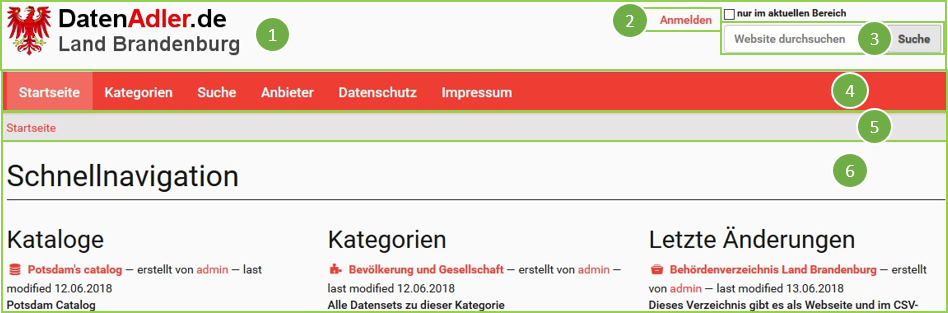
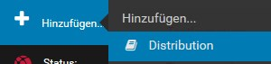

August 2018 – Bertheau, Hiller, Kohlhagen, Peverali

# Open Data in den Kommunen des Landes Brandenburg
**Eine Handreichung für die redaktionelle Arbeit mit dem DatenAdler**


**Autoren:**
* Clementine Bertheau
* Johannes Hiller
* Marco Kohlhagen
* Francois Peverali


**Herausgeber:**  \
Frank Schiersner  \
Referat 11  \
[webredaktion@mik.brandenburg.de](mailto:webredaktion@mik.brandenburg.de)

Ministerium des Inneren und für Kommunales des Landes Brandenburg (MIK)  \
Henning-von-Tresckow-Str. 9-13  \
14467 Potsdam

**Kostenloser Download:**  \
[https://github.com/BB-Open/open-data-handreichung](https://github.com/BB-Open/open-data-handreichung)

**Lizenz:**  \
[Datenlizenz Deutschland Zero Version 2.0](https://www.govdata.de/dl-de/zero-2-0) (dl-zero-de/2.0)

 
**Verwendete Grafiken:** 
* Deckblatt, Seite 10: eagle.svg
  * Quelle: https://www.creativetail.com/40-free-flat-animal-icons/
  * Lizenz: CC BY 4.0: [https://creativecommons.org/licenses/by/4.0/](https://creativecommons.org/licenses/by/4.0/)
  * Modifikation: Hintergrundfarbe Rot
  * zuletzt zugegriffen: 01.09.2018

* Seiten 9, 10, 12, 20: discussion.png
  * Quelle: [https://commons.wikimedia.org/wiki/File:Discussion.png](https://commons.wikimedia.org/wiki/File:Discussion.png)
  * Von: MRafizeldi
  * Lizenz: CC BY-SA 3.0, [https://creativecommons.org/licenses/by-sa/3.0/deed.en](https://creativecommons.org/licenses/by-sa/3.0/deed.en)
  * Modifikation: Farben
  * zuletzt zugegriffen: 01.09.2018

**Version:** **1.0** vom 7.9.2018

---

## Einführung in die Handreichung

Die vorliegende Handreichung richtet sich an die Kommunen im Land
Brandenburg und soll als Unterstützung beim Umgang mit dem Thema Open
Data dienen. Auch wenn die Kommunen im Land Brandenburg nicht
verpflichtet sind, Daten, die im Zuge ihrer Arbeit anfallen, zu
veröffentlichen, sollen sie dennoch dazu angehalten und motiviert
werden. Auch kommunale Daten sind interessant für Bürger, Unternehmen
und andere Verwaltungen. Das übergeordnete Open-Data-Ökosystem
ermöglicht, offene Veraltungs- und Regierungsdaten aller Ebenen auf
Portalen einzusehen, zu verwenden und daraus einen Wert zu erschaffen.

Auf den folgenden Seiten wird im ersten Abschnitt darauf eingegangen,
warum es wichtig und lohnend ist, sich als Kommune mit dem Thema Open
Data auseinanderzusetzen. Im zweiten Abschnitt werden Hinweise und
Hilfestellungen gegeben, wie sich die Kommunen im Land Brandenburg der
Arbeit mit Open Data nähern können und welche Vorüberlegungen zu treffen
sind. Der dritte Abschnitt umfasst konkrete operative Werkzeuge zur
Datenbereitstellung durch die Kommunen auf dem Landesportal
[DatenAdler.de](https://datenadler.de).

## Inhalt

**[Warum sollte ich mich mit dem Thema Open Data auseinandersetzen?](#warum-sollte-ich-mich-mit-dem-thema-open-data-auseinandersetzen)**
* [Open Government](#open-government)
  * [Transparenz](#transparenz)
  * [Partizipation](#partizipation)
  * [Kollaboration](#kollaboration)
* [Open Data](#open-data)
* [Hintergründe und aktuelle Lage](#hintergründe-und-aktuelle-lage)
* [Chancen und Nutzen](#chancen-und-nutzen)
  * [Bürgerinnen und Bürger](#bürgerinnen-und-bürger)
  * [Politik und Verwaltung](#politik-und-verwaltung)
  * [Wirtschaft](#wirtschaft)
* [Referenzprojekte](#referenzprojekte)
  * [Wheelmap](#wheelmap)
  * [Transparent München](#transparent-münchen)
  * [GeoLytix](#geolytix)
  
**[Wie gehe ich an die Arbeit mit Open Data heran?](#wie-gehe-ich-an-die-arbeit-mit-open-data-heran)**
* [Datenqualität](#Datenqualität)
* [Identifizierung relevanter Datensätzen auf kommunaler Ebene](#identifizierung-relevanter-Datensätzen-auf-kommunaler-ebene)
  * [Fragenkatalog](#fragenkatalog)
* [Datenschutz](#datenschutz)
  * [Risikoabschätzung](#risikoabschätzung)
  * [Schutzmaßnahmen zur Veröffentlichung der gelben Datensätze](#schutzmaßnahmen-zur-veröffentlichung-der-gelben-datensätze)
*[Lizenzen](#lizenzen)
*[Rahmenbedingungen zur Nutzung des DatenAdlers](#rahmenbedingungen-zur-nutzung-des-datenadlers)

**[Wie arbeite ich mit dem DatenAdler?](#wie-arbeite-ich-mit-dem-datenadler)**
* [Funktionsweise des DatenAdlers](#funktionsweise-des-datenadlers)
  * [Zusammenfassung: Der kürzeste Weg zur Veröffentlichung meines ersten Open-Data-Datensatzes](#zusammenfassung-der-kürzeste-weg-zur-veröffentlichung-meines-ersten-open-data-datensatzes)
* [Der Metadatenstandard DCAT-AP](#der-metadatenstandard-dcat-ap)
  * [Gesamtkatalog](#gesamtkatalog)
  * [Datenstruktur](#datenstruktur)
  * [Distribution](#distribution)

**[Anhang](#anhang)**
* [Schlagwortverzeichnis „DatenAdler“ A-Z](#schlagwortverzeichnis-datenadler-a-z)
 

Warum sollte ich mich mit dem Thema Open Data auseinandersetzen?
================================================================
Die ständige Schaffung, Ansammlung und Auswertung unzähliger
elektronischer Daten prägt den digitalen Wandel im 21. Jahrhundert.
Daten sind eine neuartige und unerschöpfliche Ressource. Es ist nicht
verwunderlich, dass sie und die auf ihnen basierenden Informationen, den
Grundstein vieler neuartiger, digitaler Geschäftsmodelle bilden. Der
Wert und das einhergehende Potential der Daten ist nicht mehr nur Teil
des wirtschaftlichen Denkens, sondern nimmt zunehmend auch im
Bewusstsein von öffentlichen Verwaltungen einen Platz ein.

Open Government
---------------

Open Government beschreibt die Öffnung von Regierungs- und
Verwaltungshandeln gegenüber den Akteuren einer Gesellschaft, zu denen
die Bürgerinnen und Bürger, die Wirtschaft, die Wissenschaft, die Medien
und auch Verwaltungen und Regierungen selbst zählen. Den Akteuren soll
die Beteiligung an staatlichen Entscheidungs- und
Leistungserstellungsprozessen ermöglicht bzw. erleichtert werden. Zudem
findet eine Neugestaltung der Zusammenarbeit zwischen öffentlichen
Verwaltungen, der Gesellschaft und der Wirtschaft statt. Der Open
Government Ansatz wird dabei von drei grundlegenden Säulen getragen:
Transparenz, Partizipation und
Kollaboration[Fn1](#fn1), [Fn2](#fn2), [Fn3](#fn3).

### Transparenz

* Bereitstellung der Daten über Portale
* Offenlegung von Strukturen, Prozessen und Datenbeständen
* Schaffung von Interesse, Verständnis und Vertrauen
* Nachvollziehbarkeit von Entscheidungsprozessen
* Aufdeckung von Missständen und Steuerungsproblemen

### Partizipation

* Basiert auf Transparenz
* Förderung der Bürgerbeteiligung
* Integration der Bürger in den öffentlichen Sektor
* Minderung der Informationssymmetrie zwischen Verwaltung und Gesellschaft
* Befähigung der Gesellschaft durch verschiedene Partizipationsmöglichkeiten

### Kollaboration

* Zusammenarbeit von Staat oder Verwaltung mit Bürgerinnen und Bürgern, Wirtschaft sowie nicht staatlichen Organisationen
* Interaktion auf Augenhöhe
* Persönlicher Dialog und Zusammenarbeit

 

Open Data
---------

Der Begriff „Open Data“ (zu Deutsch „offene Daten“) beschreibt die Idee
der öffentlichen Bereitstellung von maschinenlesbaren Informationen zur
freien Verwendung und Verarbeitung. Die Bereitstellung erfolgt dabei
kostenfrei und wird durch dafür vorgesehene Portale realisiert. Eine
Limitierung der offenen Daten besteht lediglich für personenbezogene
oder unter Datenschutz stehende Daten. Im speziellen Kontext von
öffentlichen Verwaltungen wird Open Data als „Open Government Data“
bezeichnet. Das Konzept bleibt hierbei dasselbe. Ziel ist weiterhin,
Wissen frei zugänglich zu machen. Im Fokus stehen dabei hauptsächlich
Daten, die im Zuge der Arbeit von Behörden unter Nutzung von
Steuergeldern entstanden sind. Open Government Data bildet eine
Teilmenge von Open Government und stellt somit einen wesentlichen
Grundbaustein für die Schaffung von Transparenz im Sinne von Open
Government dar. Um einen gewissen Standard bei der Veröffentlichung zu
fördern, definierte die Sunlight Foundation bereits 2007 zehn Prinzipien
zur Öffnung von Regierungsdaten[Fn4](#fn4):

**1. Vollständigkeit**

Datensätze, die von Regierung und Verwaltung veröffentlicht werden,
sollten so vollständig wie möglich sein und den ganzen vorliegenden
Umfang an Daten zu einem Thema umfassen. Auch die Metadaten, die der
Definition und Erklärung der Daten dienen, sollten ergänzt werden.
Gesetze zum Schutz personenbezogener Daten müssen eingehalten werden.

**2. Primärquellen**

Bei den veröffentlichten Datensätzen sollte es sich um Primärquellen
handeln. Es sollen die ursprünglich von der Regierung erhobenen
Informationen, Details darüber, wie die Daten gesammelt wurden sowie die
ursprünglichen Quelldokumente bereitgestellt werden.

**3. Zeitliche Nähe**

Regierung und Verwaltung sollten die Datensätze zeitnah nach Erhebung
und Zusammenstellung veröffentlichen. Dies ist insbesondere wichtig bei
Daten, deren Nützlichkeit zeitabhängig ist.

**4. Leichter Zugang**

Die zur Verfügung gestellten Daten sollten einfach eingeholt werden
können. Hürden zum automatisierten elektronischen Zugang sollten so
niedrig wie möglich gehalten werden. Auch eine einfache Auffindbarkeit
sollte gewährleistet sein.

**5. Maschinenlesbarkeit**

Die Daten sollten, sofern möglich, in etablierten Dateiformaten
bereitgestellt werden, die maschinenlesbar sind.

**6. Diskriminierungsfreiheit**

Jede Person sollte zu jeder Zeit auf die Daten zugreifen können. Dabei
sollte keine Identifizierung oder Rechtfertigung erforderlich sein.

**7. Verwendung offener Standards**

Es sollen offene Standards in Bezug auf die verwendeten Formate genutzt
werden. Es sollte keine kostspielige Software-Lizenz notwendig sein, um
die bereitgestellten Daten nutzen zu können.

**8. Lizensierung**

Die Daten sollten maximal offen bereitgestellt werden, d.h. im Idealfall
ohne Nutzungsbeschränkungen.

**9. Dauerhaftigkeit**

Die zur Verfügung gestellten Daten sollten dauerhaft online auffindbar
sein. Dies kann durch eine Versionierung und Archivierung umgesetzt
werden. Aktualisierungen, Veränderungen oder Entfernung der Daten sollte
entsprechend beschrieben und gekennzeichnet werden.

**10. Nutzungskosten**

Es sollten keine Kosten für die Nutzung der Daten erhoben werden.

Hintergründe und aktuelle Lage
------------------------------

Auf dem G8-Gipfel in Lough Erne im Juni 2013 beschlossen die
vorsitzenden acht Staaten eine Open-Data-Charta und bekannten sich damit
auf internationaler Ebene zur Veröffentlichung von Verwaltungsdaten. Die
Umsetzung der Charta ist in Deutschland 2014 in Form eines Nationalen
Aktionsplans der Bundesregierung festgelegt worden, der vier
Verpflichtungen enthält[Fn5](#fn5):

1. Ein klares Richtungssignal für offene Daten in Deutschland

2. Die Veröffentlichung von Datensätzen

3. Die Veröffentlichung der Daten auf einem nationalen Portal

4. Maßnahmen zu Konsultation, Engagement und Erfahrungsaustausch

Bisher sind nur die Behörden der unmittelbaren Bundesverwaltung gemäß
§12a des E-Government-Gesetzes angehalten, ihre elektronischen Daten
öffentlich zur Verfügung zu stellen. Im Land Brandenburg liegt zwar ein
abgestimmter E-Government-Gesetzentwurf vor, der bis Ende 2018
verabschiedet werden soll[^6^](#footnote6), eine Verpflichtung zur
Öffnung der Verwaltungsdaten auf Landes- und kommunaler Ebener wird aber
auch mit dem neuen Gesetz nicht erfolgen. Trotzdem sind auch Kommunen
dazu angehalten, ihre Verwaltungsdaten zu veröffentlichen. Welche
Chancen und Nutzen sich durch die Veröffentlichung ergeben, wird im
Folgenden näher erläutert.

Chancen und Nutzen
------------------

Open Data bietet ein breites Spektrum an Potentialen, sofern Daten
umfangreich und maschinenlesbar veröffentlicht werden. Transparenz,
Vertrauen, Innovationsförderung und Wirtschaftswachstum sind hierbei
zentrale Aspekte, die den Nutzen von Open Data beschreiben. Allgemein
können drei Bereiche/Akteure herausgestellt werden, die von einer
Öffnung der Daten profitieren: Bürgerinnen und Bürger, Politik und
Verwaltung, sowie die Wirtschaft.[^7^](#footnote7)^,[^8^](#footnote8)^

### Bürgerinnen und Bürger

* Erhöhung politischer Transparenz
* Umfassende Informationen über das staatliche Handeln
* Verbesserte Ausübung demokratischer Rechte und Pflichten
* Bürgerpartizipation
* Vorteile im Alltag

### Politik und Verwaltung

* Verbesserte Effizienz und Wirksamkeit von Behördendienstleistungen
* Aufwands- und Kostenreduzierung beim Informationsaustausch
* Steigerung der Datenqualität
* Befähigung der Bürger
* Vertrauens- und Akzeptanzsteigerung
* Imageverbesserung

### Wirtschaft

* Geschätzter Wert von ca. 140 Mrd. Euro pro Jahr
* Kostengünstige Wirtschaftsförderung
* Möglichkeit der Kombination von Datenquellen
* Erkennen von Mustern aus großen Datensammlungen
* Innovationspotenzial für Gründer
* Verbesserte Produkte oder Dienstleistungen in der Privatwirtschaft
* Weiterverarbeitung und Veredelung der offenen Daten

Referenzprojekte
----------------

Es gibt verschiedene Referenzprojekte[^9^](#footnote9), bei denen der
Nutzen und die Chancen, die durch die Öffnung von Daten entstehen,
erkennbar werden. Diese sind nicht immer ausschließlich einzelnen
Bereichen/Akteuren zuzuordnen und bedienen oftmals eine Schnittmenge der
verschiedenen Interessen. Sie reichen dabei von den Alltag verbessernden
Lösungen, über neue Partizipationsmöglichkeiten der Bürger, bis hin zu
grundlegenden Innovationen.

### Wheelmap


Die [Wheelmap](https://wheelmap.org/map) ist eine auf OpenStreetMap
basierende Karte, die es Rollstuhlfahrern ermöglicht, ihren Alltag
besser zu planen und somit diesen enorm zu erleichtern. Die Karte zeigt
an, wie rollstuhlgerecht öffentliche Orte ausgestattet sind und nutzt
hierzu ein einfaches Ampelsystem. Dieses lässt mit einem Blick auf die
Karte schnell erkennen, ob beispielsweise Aufzüge vorhanden sind, oder
hohe Randsteine die Mobilität einschränken. Durch ein
Crowdsourcing-Prinzip können durch die Nutzer weitere Ortshinweise
hinzugefügt oder ergänzt werden. Aktuell kommen täglich ca. 300 neue
Einträge hinzu.

### Transparent München


Das Portal [Transparent München](https://www.muenchen-transparent.de/)
gibt Bürgern die Möglichkeit, sich über aktuelle Vorgänge des Stadtrats
und der Verwaltung umfänglich zu informieren. Einsehbar sind etwa die
aktuellen Mitglieder des Stadtrats und der Bezirksausschüsse oder die
Beschlüsse. Ein virtueller Kalender gibt zudem Aufschluss über
Stadtrats- und Ausschusssitzungen. Des Weiteren können bequem Dokumente,
wie beispielsweise verschiedene Vorlagen, bezogen werden. Interessierte
Bürger können sich regelmäßig per E-Mail über neue Dokumente
benachrichtigen lassen, oder mittels Schlagwortsuche nach den
gewünschten Inhalten suchen. Transparent München stellt somit
verschiedene Möglichkeiten der Bürgerpartizipation bereit.

### GeoLytix

GeoLytix ist ein Beratungsunternehmen aus Großbritannien, das seine
Kunden bei der Standortplanung und räumlichen Modellierung unterstützt.
Die Kunden stammen zumeist aus dem Einz,elhandelssektor. GeoLytix
kombiniert offene Verwaltungsdaten mit, vom Kunden bereitgestellten Daten
(zum Beispiel von Kundenkarten gesammelten Daten) und erstellt auf
dieser Basis Umsatzstrategien. Zudem entwickeln sie die für den Kunden
optimale Verkaufsstrategie. Die Kunden erlangen auf diese Weise
Erkenntnis darüber, wie viele Filialen sinnvoll sind und welche
Sortimente an welchen Standorten gewinnbringen sind.

Wie gehe ich an die Arbeit mit Open Data heran?
===============================================

```
Was ist der einfachste Weg die Datenqualität zu verbessern?

 Möchte man die Bewertung des Datensatzes verbessern, so ist der Sprung
 von 3 auf 4 Adler der einfachste. Die Software Microsoft Excel bietet 
 zum Beispiel eine einfache Möglichkeit, Tabellen in dem nicht         
 proprietären Format „CSV“ abzuspeichern. Die Funktion verbirgt sich im 
 Menü Datei -\> Speichern unter. Hier kann bei der Auswahlschaltfläche  
 „Dateiformat“ das Format „CSV“ ausgewählt und die Datei anschließend   
 abgespeichert werden.                                                  
                                                                        
 Auf demselben Weg können auch Dokumente in Microsoft Word als „OCT“    
 abgespeichert werden.                                                  
                                                                        
 **Vorsicht:** Das Dateiformat „CSV“ unterstützt keine Formatierungen.  
```


Im Folgenden wird auf die notwendige Datenqualität offener Daten, auf
die Möglichkeiten der Datenidentifizierung, auf Datenschutzmaßnahmen,
Lizensierungsmöglichkeiten sowie auf die Rahmenbedingungen zur Nutzung
des DatenAdlers eingegangen.

Datenqualität
-------------

Der Begriff der „Daten“ ermöglicht sehr viel Interpretationsspielraum.
Es handelt sich beispielsweise auch bei einem eingescannten Dokument um
Daten. Sobald dieses Dokument mit Hilfe des DatenAdlers unter einer
entsprechenden Lizenz veröffentlicht ist, wird daraus „Open Data“
(Offene Daten). Wenn ein Datenbereitsteller sich die Mühe macht, Daten
zu veröffentlichen, ist dies oft mit der Hoffnung verbunden, die
eingangs beschriebenen positiven Effekte hervorzurufen. Um die Chance zu
erhöhen, dass die Daten später wirklich Verwendung finden, lohnt es
sich, sich mit der Frage der Datenqualität zu beschäftigen.

Ob und wie die Daten nach der Veröffentlichung genutzt werden, hängt
maßgeblich von der Qualität der veröffentlichen Daten ab.

*Generell gilt jedoch: Besser Daten mit mangelhafter Qualität
veröffentlichen als keine Daten veröffentlichen.*

Um die Datenqualität zu erhöhen, genügt es manchmal schon, die Daten
einem Unbeteiligten zu zeigen. Diesem fällt oftmals schneller auf, dass
eine Tabelle keine Spaltennamen hat, eine nicht-lesbare Schriftart
verwendet wurde, oder es sich um einen veralteten Datenbestand handelt.

Um die Qualität der Daten zu bestimmen, können die zehn Prinzipien von
Open Data zur Hilfe genommen werden. Wer gerne mit Checklisten arbeitet,
kann hierfür die Vorlage aus dem
[Open-Government-Vorgehensmodell](http://www.kdz.eu/de/file/18417/download)
als Anregung verwenden. Die Werkzeuge dieses Dokuments werden bereits
erfolgreich in der Stadt Wien eingesetzt.

Einen gut verständlichen Überblick über die Begrifflichkeiten im Umgang
mit der Qualität von Daten bietet das [Schulungsmaterial der
Organisation „Open Data
Support“](https://www.europeandataportal.eu/sites/default/files/d2.1.2_training_module_2.2_open_data_quality_de_edp.pdf).

Bei Daten, die sich oft ändern, lohnt sich auch der Kontakt zur
IT-Abteilung, um herauszufinden, wie die Daten zum Beispiel automatisch
durch eine Tagesverarbeitung im DatenAdler aktualisiert werden können.
Viele IT-Systeme bieten derartige Schnittstellen. Sie steigern durch die
Automatisierung gleichzeitig die Qualität und die Aktualität der Daten.

Um die Qualität besser einschätzen zu können, vergibt die in Ab
visualisierte Klassifizierung, in Abhängigkeit von der Güte der Daten,
mindestens einen und maximal fünf Adler. Ein zusätzlicher Adler kann nur
dazugewonnen werden, wenn die Voraussetzungen der niedrigeren Stufe
bereits erfüllt sind.


*Abbildung 1: Klassifizierung Güte von Daten (in Anlehnung an „Star
scheme“ nach Tim Berners-Lee[^10^](#footnote10))*

**Was heißt eigentlich…?**

**Maschinenlesbar** – die Informationen sind speziell darauf ausgelegt worden, auch für Maschinen lesbar zu sein, anstatt nur für Menschen[^11^](#footnote11). Dies lässt sich auch daran erkennen, dass man einen Text markieren und kopieren kann.                              

**Datenformat** – beschreibt die Weise, in der die Informationen abgelegt sind. Oftmals erkennt man das Format einer Datei bereits an ihrem Namen. Die Datei „Tabelle.xls“ ist höchstwahrscheinlich im Format „xls“ (=Excel) gespeichert.                                              

**Strukturiertes Datenformat** – Daten sind strukturiert, wenn sie nicht nur wahllos, sondern zum Beispiel in einer Tabelle mit Spaltennamen abgespeichert wurden.

**Proprietäres Format** – ein Datenformat das von Dritten, ohne Schwierigkeiten und ohne den Erwerb einer speziellen Software lesbar ist[^12^](#footnote12)

**Verlinkt**– beispielsweise wird innerhalb eines Datensatzes auf andere Datensätze verwiesen. So müssen die Städtenamen zu den Postleitzahlen nicht in der Datei aufgeführt werden, es wird aber auf einen Datensatz mit den Zuordnungen verwiesen.                                           

[^11^](#footnote11back) [https://de.wikipedia.org/wiki/Maschinenlesbarkeit](https://de.wikipedia.org/wiki/Maschinenlesbarkeit),                                        uletzt zugegriffen: 01.09.2018

[^12^](#footnote12back) https://de.wikipedia.org/wiki/Propriet%C3%A4r](https://de.wikipedia.org/wiki/Proprietär),                                                   zuletzt zugegriffen: 01.09.2018


Identifizierung relevanter Datensätzen auf kommunaler Ebene
-----------------------------------------------------------

Die Identifizierung relevanter Datensätze kann zu einer Herausforderung
für Kommunen werden. Je nach Aufgabenbereich einer Kommune unterscheiden
sich die Daten, die erhoben, generiert und veröffentlicht werden können.
Um mögliche Datensätze zu identifizieren, ist es ratsam sich an §12a des
E-Government-Gesetz (EgovG) des Bundes zu orientieren, der jedoch
ausschließlich für die unmittelbaren Bundesbehörden gilt. An dieser
Stelle ist es noch einmal wichtig zu betonen, dass die Brandenburger
Kommunen keiner gesetzlichen Verpflichtung unterliegen, ihre Daten auf
dem DatenAdler zur Verfügung zu stellen. Gemäß EGovG stellen die
unmittelbaren Bundesbehörden „unbearbeitete Daten, die sie zur Erfüllung
ihrer öffentlich-rechtlichen Aufgaben erhoben haben oder durch Dritte in
ihrem Auftrag haben erheben lassen, [...] bereit“. Auch Kommunen sollten
sämtliche Daten, die sie zur Erfüllung ihrer öffentlich-rechtlichen
Aufgaben erhoben haben oder durch Dritte in ihrem Auftrag haben erheben
lassen, als offene Daten der Öffentlichkeit zur Verfügung stellen. Nur
so können die beschriebenen positiven Effekte von Open Data erreicht
werden. Zu folgenden Tätigkeitsbereichen ist die Bereitstellung von
Datensätzen generell möglich und sinnvoll[^13^](#footnote13):

Aufgabenbereich      | Daten
-------------------- | -------------
Einwohnermeldeamt               | Standorterschließung / Bau         
Abfallentsorgung                | Tourismus / Erholung
Nahverkehr                      | Bildung / Kinderbetreuung
Energie und Wasse               | Gesundheit / Soziales
Breitbandausbau und -zugang     | Umweltschutz


 

Die Brandenburger Kommunen, sowohl Ämter als auch amtsfreie Gemeinden,
stellen schon diverse Daten auf ihren eigenen Webseiten zur Verfügung.
Diese erfüllen häufig auch bereits die Anforderungen an Open Data. Wie
diese Daten über den DatenAdler verschlagwortet werden können und sich
somit im Open-Data-Ökosystem wiederfinden, ist in den nachfolgenden Fu
beschrieben.

 

### Fragenkatalog

Zur Identifikation von relevanten Datensätzen, die über den DatenAdler
zur Verfügung gestellt werden sollen, kann der folgende Fragebogen als
Gedankenstütze dienen:

#### Datenbestand:
**Welche Daten fallen bei unserer Arbeit an und liegen bereits in einem geeigneten (maschinenlesbaren) Format vor?**
  * welche Arten von Daten werden allgemein gesammelt?  
  * in welchem Format liegen die Daten vor?
  * Kann das Format verbessert werden?
  * wer bearbeitet die Daten / bereitet die Daten auf?
  * wo werden sie abgelegt? 
  * sind die Daten dezentral oder zentral verwaltet?
  * gibt es Anwendungen/Fachverfahren, zu den Daten und können diese dadurch auch automatisiert zur Verfügung gestellt werden? 

#### Datengenerierung:
**In welchen Fachbereiche / welchen Bereichen sehen wir Potenzial, weitere Daten zur Bereitstellung auf dem DatenAdler zu generieren?**
  * welche Ebenen sammeln Daten?
  * was können wir tun, um Daten zu identifizieren (organisatorisch)?
  * Können wir uns Geschäftsmodelle vorstellen, die durch unsere Daten zu Stande kommen könnten?
  * welche Möglichkeit gibt es, die Daten in ein geeignetes Format zu bringen? 
  
#### Datennutzung:
**Wie werden unsere vorliegenden Daten aktuell genutzt?**
  * laufen bereits interne Auswertungen mit unseren Daten?
  * stellen wir Daten für externe Stellen bereit?
  * werden unsere Daten bereits von externen Organisationen angefragt? Welche Daten? Durch wen?
   

Im Rahmen von Interviews mit einzelnen Kommunen konnte identifiziert
werden, dass in den unterschiedlichen Fachbereichen der Kommunen mit
verschiedenen Fachverfahren gearbeitet wird.

Bei dieser Arbeit werden üblicherweise eine Reihe an Daten erzeugt,
ausgewertet und auch für verschiedene Stellen, andere Verwaltungen,
Unternehmen und Privatpersonen, bereitgestellt.

Je nach geographischer Lage stehen andere Daten, die zum Beispiel für
Tourismusbetriebe für die Planung der Saison relevant sind, zur
Verfügung: So betreibt die eine Kommune vielleicht eine Fähre, die
andere ist in einem besonders frequentierten Fahrradnetz angesiedelt.
Jede Kommune hat Sitzungsvorlagen, die teilweise jetzt schon in eigenen
Portalen aus Transparenzgründen bereitgestellt werden und bereits jetzt
erhalten Kommunen über Schnittstellen automatisiert Daten von
Dienstleistern oder anderen Behörden. Interessant und gefragt sind
beispielsweise die Daten der Feuerwehr zu ihren Einsätzen: Da der
Brandschutz eine Pflichtaufgabe der Kommunen ist, gehören die Daten der
Feuerwehr der Kommune und können ohne Weiteres über den DatenAdler
veröffentlicht werden. Aber auch die Daten der kommunalen
Abfallversorger könnten sowohl für Unternehmen als auch für
Privatpersonen von Interesse sein. Geodaten-Portale sind schon sehr
verbreitet, insbesondere Liegenschaftsdaten sind gefragt.

* So könnten Wohnungsverwaltungsgesellschaften sich vielleicht für die Altersstruktur der Einwohner der Kommune interessieren, also die
Meldeamtsdaten der Kommune, damit sie gezielt altersgerechten Wohnraum schaffen können.
* Das Restaurant am Marktplatz interessiert sich vielleicht für die Anzahl der Fahrradfahrer, die jährlich mit der Fähre kommen, damit Sie
spezielle Sleep & Ride Angebote schaffen können.
* Der Witwer interessiert sich vielleicht für die Haushaltsdaten, weil er wissen möchte, ob Investitionen für den Friedhof, auf dem seine Frau bestattet liegt, geplant sind. Dort gibt es bisher keine Sitzmöglichkeiten.
* Ein Startup möchte vielleicht eine App entwickeln, über die Kitaplätze im Landkreis vergeben werden.

Der eine oder andere Mitarbeiter in einer Kommune kennt sich vermutlich
bereits jetzt sehr gut mit den Datenstrukturen aus, die in einem
spezifischen Fachverfahren vordergründig Anwendung finden. Diese
Mitarbeiter gilt es zu identifizieren und bestenfalls von Beginn an im
Prozess einzubeziehen.

**Idee: Brainstorming im Team**

Es ist vielleicht nicht immer sofort einleuchtend, wofür die eigenen   
Daten interessant sein könnten, aber wenn darüber etwas nachgedacht  
wird, entstehen diverse Ideen. Um zu ermitteln, über welche Daten die 
eigene Kommune verfügt und die eine Relevanz für Bürger, Verwaltung und
Unternehmen haben, könnte ein gemeinsames Brainstorming durchgeführt   
werden. Den Nutzen der eigenen Daten zu erkennen, kann dabei helfen, die 
Akzeptanz für das Thema Open Data in der eigenen Verwaltung und die 
Motivation sich beim DatenAdler zu beteiligen, zu steigern. Dabei können
Transparenzgründe oder Innovationsgedanken sowie die einhergehende      
Wirtschaftsförderung eine Rolle spielen.                                
                                                                         
Mögliche Leitfragen, die beim Brainstorming inspirieren können, sind:   
                                                                         
* Welche Daten interessieren unsere Bürger am meisten?
* Welches Geschäftsmodell könnte ein Startup mit unseren Daten realisieren?
* Welche Daten brauchen unsere lokal angesiedelten Unternehmen, um effizienter arbeiten zu können?                                         


Datenschutz
-----------

Das Thema Datenschutz spielt im Zusammenhang mit der Öffnung von
Regierungs- und Verwaltungsdaten eine wichtige Rolle. Gemäß der
Forderung der Open Knowledge International wird in diesem Zusammenhang
das Vorgehen nach dem Prinzip „open by default“ empfohlen. Dieses
Prinzip besagt, dass Daten, die Regierungen oder Behörden zur Erfüllung
ihrer Aufgaben erheben, immer zu veröffentlichen sind, es sei denn, sie
sind sicherheitsrelevant oder haben einen
Personenbezug[^14^](#footnote14). Aufgrund von neuen Technologien wird
es leider immer einfacher, auch in anonymisierten Daten einen
Personenbezug herzustellen. Daher müssen die damit verbundenen Risiken
näher betrachtet werden. Im Folgenden wird eine Risikoabschätzung zum
Umgang mit Daten im Sinne des Datenschutzes dargelegt.

 

Zwischen Open Data und Datenschutz liegt ein offensichtlicher
Zielkonflikt vor, mit dem sämtliche Behörden, aber auch Unternehmen
umgehen müssen. Es gilt zunächst die Devise: Offene Daten sollten keine
unrechtmäßigen Geschäftsmodelle oder das Profiling[^15^](#footnote15)
von Bürgern ermöglichen.

Auf Seiten der Bürger werden insbesondere drei Datenschutzbedenken in
Bezug auf Open Data[^16^](#footnote16) geäußert:

1. Bürger befürchten, dass ihre Daten nicht vertrauenswürdig behandelt
und veröffentlicht werden und interagieren daher weniger mit
öffentlichen Behörden („Chilling Effect“)

2. Bürger befürchten einen Kontrollverlust über ihre persönlichen
Daten, wenn ihre Daten als Open Data veröffentlicht werden („Lack of
Control over Personal Information“)

3. Bürger befürchten, dass offene Daten genutzt werden können, um
soziale Einteilungen und Diskriminierungsmaßnahmen durchzuführen
(„Social Sorting and Discrimination“)

Diese Bedenken verdeutlichen, dass der Datenschutz ernst genommen werden
muss. Gleichzeitig darf er aber nicht als Vorwand verwendet werden,
relevante Daten nicht zu veröffentlichen. Der Fokus bei der Offenlegung
von Daten sollte zunächst immer auf nicht-personenbezogenen Daten liegen
und auch sicherheitsrelevante Daten von Regierungen und Behörden dürfen
selbstverständlich nicht veröffentlicht werden. Geltende Gesetzte, die
in diesem Zusammenhang Relevanz haben, sind[^17^](#footnote17):

* EU-Datenschutz Grundverordnung (EU-DSGVO)
* Brandenburgisches Datenschutzgesetz (BbgDSG)
* Akteneinsichts- und Informationszugangsgesetzes (AIG) des Landes Brandenburg
* Urheberrechtsgesetz, Markengesetz, Patentrecht

Darüber hinaus ist gilt zu prüfen, ob aus folgenden Regelungen Einschränkungen im Einzelfall gelten:

* Betriebs- und Geschäftsgeheimnisse
* Spezialgesetze: Umweltinformationsgesetz, Geodatenzugangsgesetz, Verbraucherinformationsgesetz
* Geheimschutz: Verschlusssachen im Sinne des Sicherheitsüberprüfungsgesetzes
* Andere Geheimnisschutz-relevante Bereiche: zum Beispiel Statistikgeheimnis, Steuergeheimnis

Die kommunalen Datenschutzbeauftragten sollten bei der Veröffentlichung
von Datensätzen einbezogen werden.

### Risikoabschätzung

Um den beschriebenen Zielkonflikt zwischen Open Data und Datenschutz
bestmöglich aufzulösen und den gesetzlichen Vorgaben Rechnung zu tragen,
wird eine Risikoabschätzung in Anlehnung an ein Ampelkonzept der
Stiftung Neue Verantwortung[^18^](#footnote18) und einer
Risikoabschätzung der Stadt Seattle[^19^](#footnote19) empfohlen, die im
Folgenden näher erläutert wird. Die Risikoabschätzung sollte vor der
Veröffentlichung eines Datensatzes durchgeführt werden.


Durch Stufe 1 der Risikoabschätzung soll ermittelt werden, wer der
Rechteinhaber der zu veröffentlichen Daten ist. Falls der Urheber der
Daten ein Dritter ist, muss eine Erlaubnis für die Veröffentlichung bei
der entsprechenden Person oder Institution eingeholt werden. Falls das
Urheberecht bei der der Kommune selbst liegt, kann direkt Stufe 2 der
Risikoabschätzung erfolgen.

Stufe 2 umfasst die Prüfung der Personenbezogenheit. Gemäß der EU-DSGVO
sind personenbezogene Daten alle Informationen, die sich auf eine
identifizierte oder identifizierbare natürliche Person beziehen. Als
identifizierbar wird eine natürliche Person angesehen, die direkt oder
indirekt, insbesondere mittels Zuordnung zu einer Kennung wie einem
Namen, zu einer Kennnummer, zu Standortdaten, zu einer Online-Kennung
oder zu einem oder mehreren besonderen Merkmalen identifiziert werden
kann, die Ausdruck der physischen, physiologischen, genetischen,
psychischen, wirtschaftlichen, kulturellen oder sozialen Identität
dieser natürlichen Person sind[^20^](#footnote20). Die Prüfung auf
Personenbezug sollte im Vier-Augen-Prinzip erfolgen. Bei der Prüfung
muss jeder Datensatz einzeln betrachtet werden. Wenn in einem Datensatz
kein Personenbezug besteht, kann dieser bedenkenlos als Rohdatensatz
(nicht-anonymisiert) veröffentlicht werden. Für diesen Datensatz wird
eine grüne Ampel vergeben. Bei Datensätzen, in denen ein Personenbezug
besteht, muss unterschieden werden, welcher Grad an Personenbezug
vorliegt. Bei geringem Grad an Personenbezug wird eine gelbe Ampel
vergeben werden und der Datensatz kann nach der Anwendung von
Schutzmaßnahmen, die im nächsten Abschnitt näher beschrieben werden,
veröffentlicht werden. Bei einem hohen Grad an Personenbezug, darf der
Datensatz auf keinen Fall veröffentlicht werden. In diesem Fall ist kein
sinnvoller Einsatz von Schutzmaßnahmen möglich und der Datensatz wird
mit einer roten Ampel gekennzeichnet.

Bei einem nachträglichen Bekanntwerden eines Personenbezugs in einem von
einer Kommune veröffentlichten Datensatz sollte dieser unverzüglich vom
Portal entfernt werden. Die Beachtung des Datenschutzes ist keine
einmalige Angelegenheit, sondern ein fortwährender Prozess. Wie dieser
Prozess konkret gestaltet wird und welche Mitarbeiter einer Kommune
neben dem oder der Datenschutzbeauftragten dabei einbezogen werden,
obliegt den Kommunen. Die Stiftung Neue Verantwortung bietet zur
Umsetzung einen Werkzeugkasten an, der kostenlos im Internet verfügbar
ist:
https://www.stiftung-nv.de/de/publikation/leitfaden-für-datenschutz-bei-open-data.

### Schutzmaßnahmen zur Veröffentlichung der gelben Datensätze

Ein Personenbezug in Daten kann durch Anonymisierung entfernt werden.
Eine Anonymisierung ist möglich durch:

* Aggregation / Zusammenfassung von Daten (z.B. zu einer Statistik)
* Entfernung von betroffenen Feldern in Datensätzen
* Schwärzung von Details

Eine vollständige, nicht wiederherstellbare Anonymisierung bei
gleichzeitiger Aufrechterhaltung der Nützlichkeit des Datensatzes ist
quasi unmöglich. Auch mit vermeintlich anonymisierten Daten können in
Verbindung mit anderen Daten Rückschlüsse auf die tatsächliche Identität
von Bürgern hergestellt werden. Es wird empfohlen, trotzdem alle Daten
zu veröffentlichen, bei denen die Kommune selbst keinen Personenbezug
herstellen kann. Im Zuge der Veröffentlichung könnte unter der
Beschreibung der Datenstruktur beispielsweise darauf hingewiesen werden,
dass eine Nutzung von eventuell personenbezogenen Daten im vorliegenden
Datensatz nicht erlaubt ist.

Lizenzen
--------

Bei der Veröffentlichung von Open Data ist es wichtig, die Bedingungen,
unter denen sie genutzt werden können festzulegen. Um dies zu
vereinfachen, haben die Organisationen „Creative Commons“ und „Open Data
Commons“ allgemein anerkannte Standards veröffentlicht, die
Nutzungsbedingungen eindeutig regeln. In Anlehnung an diese weltweiten
Standards wurde in Deutschland von Bund, Ländern und kommunalen
Spitzenverbänden eine spezielle Lizenz für die Veröffentlichung von
Verwaltungsdaten in Deutschland entwickelt. Diese eignet sich explizit
für (offene) Verwaltungsdaten im deutschen Recht[^21^](#footnote21). Es
wird empfohlen, die „Datenlizenz Deutschland“ in einer der zwei
verfügbaren Versionen zu nutzen:

* **Datenlizenz Deutschland – Zero – Version 2.0 (dl-zero-de/2.0)**
ermöglicht eine einschränkungslose Weiterverwendung des Dokuments/Datensatzes
* **Datenlizenz Deutschland – Namensnennung – Version 2.0 (dl-by-de/2.0)**
verpflichtet den Datennutzer, den jeweiligen Datenbereitsteller zu nennen

**Tipp:** Fällt die Entscheidung für die Lizenz „dl-by-de/2.0“, wird die
Nutzung des DatenAlder-Formularfeldes „Namensnennungstext für
"by"-Lizenz“ empfohlen. Hier kann dem Nutzer der Daten direkt mitgeteilt
werden, wie er auf die Quelle der Daten zu verweisen hat. Anderenfalls
werden die Nutzer der Daten individuelle Anfragen zur Quellenangabe an
die Kommune stellen.

Die Veröffentlichung von Daten über den DatenAdler erfordert nicht
zwingend die Festlegung einer Lizenz. Damit die Daten aber auch über das
deutsche OpenData-Portal „govdata.de“ auffindbar sind, muss eine Lizenz
angegeben sein.

Rahmenbedingungen zur Nutzung des DatenAdlers
---------------------------------------------

Der Weg, die eignen Daten (Data) zu offenen Daten (Open Data) zu machen,
ist nicht weit. Er besteht lediglich darin, sich Gedanken zur
[Lizenzierung](#Lizenzen) zu machen, die Daten im Internet zur Verfügung
zu stellen und in einem Open-Data-Portal zu verschlagworten. Dadurch
werden die Daten langfristig für Mensch und Maschine auffindbar,
erlangen eine größere Reichweite und können mit anderen Daten verknüpft
werden.

Das deutschlandweit bekannteste Open-Data-Portal der öffentlichen
Verwaltung ist „GovData – Das Datenportal für Deutschland“. Es ist eine
Anwendung des IT-Planungsrates[^22^](#footnote22) und stellt die oberste
Hierarchieebene von Open-Government-Data-Portalen in Deutschland dar. Es
hat den Anspruch, alle landesweiten und kommunalen offenen Daten
Deutschlands zu beinhalten und ist eine Umsetzungsmaßnahme des bereits
erwähnten Nationalen Aktionsplans.

GovData ist demnach auch die zentrale Anlaufstelle für Daten, die im
Land Brandenburg anfallen. Das Land Brandenburg erfasst seine Daten auf
einem eigenen Open-Data-Portal, dem DatenAdler. Es ist jedem unter der
Internetadresse [https://datenadler.de](https://datenadler.de) frei
zugänglich. Neben Daten, die auf landesweiter Ebene zur Verfügung
gestellt werden, hat der DatenAdler das Ziel, kommunale Daten zu
verzeichnen und diese somit automatisch auch auf dem GovData-Portal zu
veröffentlichen.

**Die Nutzung des DatenAdlers ist für Kommunen des Landes Brandenburg kostenlos.**

Kommunen können Daten, die zum Beispiel bereits auf ihrer Homepage
stehen, im DatenAdler per „Linking“ zugänglich machen oder Rohdaten
direkt über den DatenAdler per „Hosting“ hochladen und veröffentlichen.

Das Portal ist auch in der Lage, auf Daten die bereits in einem
kommunalen Open-Data-Portal (wie
[https://opendata.potsdam.de/](https://opendata.potsdam.de/))
veröffentlicht sind automatisch per „Harvesting“ zu verweisen. Es ist
auch beabsichtigt, dass in Zukunft auch die Geodaten der kommunalen
Geodaten-Portale geharvested werden^[^23^](#footnote23)^.

Der DatenAdler ist nicht dafür ausgelegt, die enthaltenen Daten direkt
zu verarbeiten. Er stellt ein reines Verzeichnis für Metadaten dar.
Metadaten sind strukturierte Daten, die Informationen über Merkmale
anderer Rohdaten enthalten[^24^](#footnote24). Beispielsweise ist die
Information über den Autor eines Buches ein Metadatum des jeweiligen
Buches.

Bestehenden Open Data-Portalen soll der DatenAdler keine Konkurrenz
machen. Er soll der Brandenburger Open Data-Bewegung lediglich als
„Schaufenster“ dienen und ermöglichen, dass die bestehenden Daten auch
auf Bundes- und europäischer Ebene platziert werden.

Wie arbeite ich mit dem DatenAdler?
===================================

Im Folgenden wird die Funktionsweise des DatenAdlers beschrieben. Dabei
wird auf die zur Verfügung stehenden Werkzeuge und Rollen eingegangen.
Daran anschließend wird der Metadatenstandard DCAT-AP erläutert.

Funktionsweise des DatenAdlers
------------------------------

Im folgenden Kapitel wird der Aufbau und die Funktionsweise des
DatenAdlers erklärt. Das Kapitel soll als Anleitung für die tägliche
redaktionelle Arbeit mit dem Portal dienen.

Ab zeigt den grundsätzlichen Aufbau des DatenAdlers für unangemeldete
Nutzer. Die Seite besteht aus einer Kopfzeile (1), mit einer
Schaltfläche zur Anmeldung (2) und einer Suchfunktion (3).

Darunter ist die Navigationszeile (4) angeordnet. Sie bietet einen
schnellen Zugriff auf die Seitenbereiche „Kategorien“, „Suche“,
„Anbieter“, „Datenschutz“ und „Impressum“ sowie die Möglichkeit, mit
einem Klick zur „Startseite“ zurückzugelangen.



 


Die dritte Zeile (5) zeigt die jeweilige Einordnung der aktuell
aufgerufenen Unterseite an. Sie ermöglicht ein schnelles Navigieren zur
jeweiligen Oberseite. Die Unterseite „Testkommune“ im abgebildeten
Beispiel (Ab) ist eine Unterseite von „Kommunen“ und diese wiederum ist
unterhalb der „Startseite“ eingeordnet.

Der DatenAdler unterscheidet zwischen der Nutzung ohne Anmeldung (Ab)
und verschiedenen angemeldeten Nutzern, die jeweils nur Zugriff auf die
Inhalte ihrer Kommune haben. Innerhalb des Bereichs einer Kommune
bestimmen Berechtigungsrollen die Rechte der Nutzer. Beim Anlegen eines
Nutzers legt die Nutzerverwaltung[^25^](#footnote25) die notwendige
Berechtigungsrolle nach dem Schema in Ta fest.

*Tabelle 1: Rollenkonzept*


**Rollen und Rahmenbedingungen**

* **ProviderDataEditor**
  * Dem Nutzer obliegt die eingeschränkte Anpassung und Gestaltung der Seite der Kommune.
  * Der Datenbereitsteller kann Rohdaten innerhalb einer Distribution hochladen oder auf Daten außerhalb des Portals (zum Beispiel auf eigener Webseite) verweisen.
  * Ein Katalog ist bereits vorgegeben.
  * *Es können lediglich Datensätze und Distributionen innerhalb des vorgegebenen Katalogs angelegt werden.
* **ProviderChiefEditor**
  * Der Nutzer verfügt über alle Berechtigungen der Rolle „ProviderDataEditor“.
  * Der Nutzer hat erweiterte Gestaltungsmöglichkeiten für die Seite der Kommune. So kann diese zum Beispiel mit verantwortlichen Stellen, Unterseiten, Dateien und Bilder angereichert werden. 
* **ProviderAdmin**
  * Der Nutzer verfügt über alle Berechtigungen der Rolle „ProviderChiefEditor“.
  * Der Datenbereitsteller hat die volle Kontrolle über seinen Bereich: Kataloge, Daten und die Seite der Kommune können nach Belieben verwaltet werden. 

Nach der erfolgreichen Anmeldung (Ab, Nummer 2) erscheinen in der
Navigationszeile zusätzlich die Schaltflächen [Dashboard] und [Hilfe]
(Ab, Nummer 7).

Das [Dashboard] (Ab) ist eine persönliche Seite für den angemeldeten
Benutzer. Hier findet sich ein Verweis auf die eigene Kommunenseite (9),
eine Angabe zur Nutzung des Datenspeichers (10) sowie ein Verweis auf
den dazugehörigen Datenkatalog (11). Zusätzlich befindet sich nach der
Anmeldung eine Werkzeugbox (8) am linken Rand der Webseite.


*Abbildung 4: DatenAdler nach Anmeldung [Dashboard]*


Die Werkzeugbox (Ab, Nummer 8) stellt in Abhängigkeit zur aufgerufenen
Seite verschiedene Werkzeuge zur Verfügung. Nutzer haben beispielsweise
keine Berechtigung die Startseite des DatenAdlers zu bearbeiten.
Befindet man sich also auf der Startseite des DatenAdlers, bleibt die
Werkzeugbox weitestgehend leer (4). Es bestehen lediglich folgende
Möglichkeiten durch das Klicken auf den jeweiligen
Werkzeugkasteneintrag:

- (11): Vergrößern / Verkleinern der Darstellung der Werkzeugbox
- (12): Anzeigen (Aktualisieren) / Wechsel in den Anzeigemodus der aktuell aufgerufenen Seite
- (13): Aufrufen der Änderungshistorie der aktuell aufgerufenen Seite
- (14): Anzeigen der möglichen Aktionen für den angemeldeten Benutzer
  * (14.1): Aufrufen der eigenen Einstellungen mit Möglichkeit der Passwortänderung
  * (14.2): Aufrufen des [Dashboards], einer selbst konfigurierbaren Übersichtsseite, des Nutzers 

  * (14.3): Abmelden des aktuell angemeldeten Nutzers


Wenn sich ein Nutzer aber auf einer von ihm verantworteten Seite
befindet, stehen ihm mehr Werkzeuge zur Verfügung. Ruft beispielsweise
ein Nutzer der Rolle „ProviderChiefEditor“ über das [Dashboard] seine
Kommunenseite auf, stehen ihm folgende Werkzeuge zusätzlich zur
Verfügung (Ab):

- (15): Wechsel zum Bearbeitungsmodus der aktuell aufgerufenen Seite
- (16): Hinzufügen eines Objekts als Unterelement der aktuell aufgerufenen Seite\
Auf der Startseite der Kommune können Nutzer der Rolle „ProviderChiefEditor“ folgende Objekte hinzufügen:

- (16.1) Bilder
- (16.2) Dateien

- (16.3) Ordner
- (16.4) Seiten
- (17): Ändern des Status der aktuell aufgerufenen Seite (Privat = nur für aktuellen Benutzer ersichtlich, Veröffentlichen = Seite
unangemeldeten Nutzern des DatenAdlers zugänglich machen)
- (18): Kopieren oder Einfügen einer anderen Seite als Unterseite der aktuell aufgerufenen Seite
- (19): Verändern der Darstellungsweise der Seite (Vorsicht: Eine Änderung betrifft die Darstellung für alle Benutzer!)

### Zusammenfassung: Der kürzeste Weg zur Veröffentlichung meines ersten Open-Data-Datensatzes

**Schritt**  | **Aktion**               | **Schaltfläche**
-------------|--------------------------|--------------------------
 1           | Anmelden mit Benutzername und Passwort   | 
 2           | Aufrufen meines persönlichen [Dashboards] | 
 3           | Aufrufen des Gesamtdatenkatalogs meiner Kommune | 
 4           | Datenstruktur anlegen. \ Über Werkzeugbox (8) Hinzufügen -\> Datenstruktur | 
 5           | Ausfüllen der Pflichtfelder (zu erkennen an rotem Punkt, zum Beispiel , dann „Speichern“  | 
 6           | Distribution (die Daten an sich) anlegen. \ Über Werkzeugbox (8) Hinzufügen -\> Distribution  | 
 7           | Ausfüllen der Pflichtfelder mit Titel und Beschreibung, dann „Speichern“ | 
 8           | Distribution veröffentlichen. \ Über Werkzeugbox (8) Status -\> Veröffentlichen  | 


Der Metadatenstandard DCAT-AP
-----------------------------

Beim Anlegen von Datenstrukturen sind bestimmte Eigenschaften für die
Eingabe in den Textfeldern zu beachten. Die Richtlinien für die
Texteingabe in den Feldern werden durch einen Metadaten-Standard
bereitgestellt: DCAT-AP.de. Dieser ist seit Juni 2018 auf Bundes- und
Landesebene für die Bereitstellung von Open Data in der Bundesrepublik
Deutschland bindend. Es handelt sich um eine deutsche Spezifikation des
europäischen *Application Profile* DCAT-AP, der wiederum vom Data
Catalogue Vocabulary (DCAT) abgeleitet ist. Die Einhaltung dieses
Standards gewährt Interoperabilität über die verschiedenen Portalebenen
(von der kommunalen zur europäischen) und erlaubt eine erleichterte
Auffindbarkeit der Datensätze, auch durch Suchmaschinen.

Die drei wesentlichen Klassen, die DCAT-AP.de zur strukturierten
Beschreibung von Datensätzen vorsieht, sind der Gesamtkatalog (auch
Katalog), die Datenstruktur und die Distribution. Im Folgenden soll der
Umgang mit den Klassen bei der Arbeit mit dem DatenAdler dargestellt
werden.

### Gesamtkatalog

Im DatenAdler wird für jede Kommune bei der Zuweisung eines Accounts ein
eigener Gesamtkatalog angelegt.

Der Gesamtkatalog enthält mindestens eine Datenstruktur.

### Datenstruktur

Eine Datenstruktur enthält mindestens eine Distribution. Im DatenAdler
müssen als Feldeingaben für eine Distribution der Titel und eine
Beschreibung angegeben werden.


*Abbildung 7 : Sicht beim Anlegen einer Datenstruktur*

#### *Titel*

Für den Titel (20) gibt man eine passende Bezeichnung für das Dokument
oder die Dokumentsammlung an. Eine Ortsangabe ist nicht notwendig, da
diese aus anderen Metadaten hervorgeht.

*Beispiel: Die Gemeinde Eichwalde hat ein Baumkataster, das sie
veröffentlichen möchte.*

*Feldeingabe Titel: Baumkataster*

#### *Beschreibung*

Im Feld „Beschreibung“ (21) sollte eine Zeitangabe zu den Daten
erfolgen. Dabei sollten bei der Eingabe ggf. die Zeiträume verschiedener
Distributionen (s.u.) zusammengefasst werden.

*Beispiel: Die Dateien, die ein Baumkataster innerhalb einer
Datenstruktur aufführt, stammen aus den Jahren 1999-2017* (egal, ob
dabei verschiedene Dokumente oder ein einziges zur Verfügung gestellt
werden sollen)*.*

*In der Beschreibung anführen: Das Baumkataster umfasst die Jahre
1999-2017.*

Liegen die Daten in einem Tabellenformat vor, eignen sich die
Spaltenbezeichnungen zur Beschreibung im entsprechenden Feld der
Beschreibung.

*Beispiel: Für ein Baumkataster könnten folgende Spaltenbezeichnungen
aufgeführt werden: Gattung, Baumart, Pflanzjahr, Straße,
Kronendurchmesser, Stammumfang etc.*

Handelt es sich bei den zu veröffentlichenden Daten dagegen um
unstrukturierte Dokumente in PDF oder ähnlichen Textformaten, können
andere Wege zu einer effizienten Beschreibung dienlich sein. Ist der
zuvor gewählte Titel nicht aussagekräftig genug, um die Dokumente zu
beschreiben, kann hier eine genauere Erläuterung hinzugefügt werden.
Handelt es sich bei der Dokumentart zum Beispiel um einen durch
Überschriften strukturierten Text, so können die Überschriften als eine
Art Inhaltsverzeichnis zur Beschreibung des Dokuments dienlich sein.

*Beispiel: Für eine mögliche Inhaltserfassung:*

*Das Dokument zu Sachverhalt XY erhält folgenden Abschnitte:*
,
*1) Einführung zu XY*

*2) Erfasste Daten zu XY in den Jahren 2000-2015*

*3) Zusammenfassung und Resultat*

Für die Beschreibung auf Distributionsebene gibt es einen größeren
Ermessensspielraum für die Kommune, die ihre Daten zur Verfügung stellt,
als bei anderen Feldern des DatenAdlers. Hier muss stets zwischen
Lesbarkeit (Umfang und Verständlichkeit) und dem Bereitstellungsaufwand
abgewogen werden.

Ist die Datenstruktur erfasst, wird durch das Anlegen einer oder
mehrerer Distributionen eine Dateninstanz verlinkt.

#### *Herausgeber*

Als Herausgeber (22) ist die Kommune anzugeben.

#### *Kategorie*

In einer Dropdown-Liste (23) lässt sich die Datenstruktur einer
vorbestimmten Kategorie des Datenadlers zuweisen.

#### *Kontakt*

Als Kontakt (24) lässt sich ggf. ein Mitarbeiter aus einer Liste
Auswählen.[^26^](#footnote26)

### Distribution


*Abbildung 8 : Sicht beim Anlegen einer Distribution (I)*

Zum Bereitstellen der eigentlichen Daten wird eine Distribution
angelegt. Im DatenAdler wird auch hierfür ein Titel vergeben. Nach
DCAT-AP.de wird eine Ressource durch die Angabe einer URL eindeutig
identifiziert. Auch Lizenzangaben werden an dieser Stelle getroffen. Das
Feld „Beschreibung“, das in der Eingabe-Maske des DatenAdlers angeführt
wird, ist auf Ebene der Distribution optional.

#### *Titel*

Im DatenAdler ist auf Ebene der Distribution ein Titel (25) anzugeben.
Es wird empfohlen, für den Titel auf der Ebene der Distribution den
Titel der übergeordneten Datenstruktur zu nutzen.

*Beispiel: Innerhalb einer Datenstruktur „Baumkataster“ können nach
Jahren differenziert CSV-Dokumente verlinkt werden.*

*Titel Distribution 1: baumkataster1990-2000*

*Titel Distribution 2: baumkataster2000-2010*

#### *Beschreibung*

Das Feld „Beschreibung“ (26) auf Ebene der Distribution ist optional und
muss dementsprechend nicht ausgefüllt werden. Gegebenenfalls können hier
spezifischere Informationen zum Dokument gegeben werden, zum Beispiel
wenn eine einzelne Distribution von ähnlichen Dokumenten abweicht oder
besondere Merkmale aufweist.

#### *Lizenz*

Die Lizenz (27) kann im DatenAdler aus einer Liste gewählt werden. Es
wird empfohlen „dl-zero-de/2.0“ zu nutzen. Weitere Informationen zu
Lizenzbestimmungen werden unter dem Abschnitt „[Lizenzen](#Lizenzen)“
bereitgestellt.


*Abbildung 9 : Sicht beim Anlegen einer Distribution (II)*

#### *URLs*

Im Umgang mit den URLs sind verschiedene Fälle zu beachten:

o Fall 1: Eine Kommune verfügt über eine eigene Webpräsenz, auf der
Daten zum Download bereitgestellt werden, die wiederum im DatenAdler als
Distribution angezeigt werden sollen.

o Fall 2: Eine Kommune verfügt über Daten, die direkt verlinkt werden
können (zum Beispiel auf einem FTP-Server hinterlegt), aber nicht auf
einer eigenen Web-Seite verlinkt sind.

o Fall 3: Eine Kommune stellt ihre Daten (und nicht ausschließlich ihre
Metadaten) über den DatenAdler bereit.

#### *Zugangs-URL (28)*

o Zu Fall 1: In diesem Fall wird eine Webseite als Distribution
angegeben, auf der mehr Informationen zur Distribution veröffentlicht
sind. Es kann sich zum Beispiel um eine Subseite der Webseite der
bereitstellenden Kommune handeln, auf der die eigentliche Distribution
liegt. Es reicht, die vollständige http-Adresse dieser Subseite aus dem
Browser zu kopieren und in das Feld „Zugangs-URL“ (28) einzufügen. Gibt
es keine Beschreibungsseite, muss auch hier die Download-URL eingetragen
werden.

o Zu Fall 2: In diesem Fall sollte im Feld „Zugangs-URL“ (28) der
direkte Download-Link für die Distribution als http-Adresse eingefügt
werden.

o Zu Fall 3: entfällt

#### *Download URL (29)*

o Zu Fall 1: In diesem Feld (29) sollte der direkte Download-Link für
d3ie Distribution als http-Adresse eingefügt werden.

o Zu Fall 2: In diesem Feld (29) sollte der direkte Download-Link für
die Distribution als http-Adresse eingefügt werden.

o Zu Fall 3: entfällt

#### *Local file (30)*

o Fall 1 und Fall 2 entfallen.

o Zu Fall 3: Eine lokal gespeicherte Datei lässt sich über einen Button
(30) hochladen. Eine zusätzliche URL muss hier nicht angegeben werden,
da sie automatisch zugewiesen wird.

#### *Namensnennungstext für "by"-Lizenz*

Auch dieses Feld (31) kann auf der Ebene der Distribution ausgelassen
werden, sofern die Lizenzangabe wie empfohlen durch die Auswahl von
„dl-zero-de/2.0“ erfolgt ist.

#### *Format*

Im Feld „Format“ (32) lässt sich das Dateiformat der Distribution
auswählen[^27^](#footnote27).

#### *Veröffentlicht und Geändert*

In den Feldern „Veröffentlicht“ (33) und „Geändert“ (34) sollte vor dem
Speichern das entsprechende Datum angegeben werden.

Anhang
======

Schlagwortverzeichnis „DatenAdler“ A-Z
--------------------------------------

+--------------------------------------+--------------------------------------+
| **Account**                          | Die Verwaltung und Vergabe der       |
|                                      | Accounts wird von der Webredaktion   |
|                                      | des MIK vorgenommen. Bei Anfragen    |
|                                      | zur Anlage und Löschung von Accounts |
|                                      | für den DatenAdler wenden Sie sich   |
|                                      | per Mail an                          |
|                                      | [webredaktion@mik.brandenburg.de](ma |
|                                      | ilto:webredaktion@mik.brandenburg.de |
|                                      | )                                    |
+--------------------------------------+--------------------------------------+
| **Benutzer**                         | Siehe „Account“                      |
+--------------------------------------+--------------------------------------+
| **Datenstruktur**                    | Eine Datenstruktur enthält           |
|                                      | Metadaten, die die zugeordneten      |
|                                      | Distributionen gemein haben. Sie ist |
|                                      | mindestens einem Katalog zugeordnet  |
|                                      | und enthält in der Regel mindestens  |
|                                      | eine Distribution. Siehe             |
|                                      | Distribution, Katalog.               |
+--------------------------------------+--------------------------------------+
| **Distribution**                     | Eine Distribution ist einer          |
|                                      | Datenstruktur zugeordnet und enthält |
|                                      | Metadaten, die sie beschreiben sowie |
|                                      | den Verweis auf die Rohdaten. Sie    |
|                                      | stellt die unterste Ebene in der     |
|                                      | Hierarchie von offenen Daten nach    |
|                                      | dem Datenstandard DCAT-AP dar. Siehe |
|                                      | Datenstruktur, Katalog.              |
+--------------------------------------+--------------------------------------+
| **Katalog**                          | Ein Katalog stellt ist eine Sammlung |
|                                      | von Datenstrukturen und              |
|                                      | Distributionen. Er wird von einem    |
|                                      | Anbieter (Kommune) veröffentlicht.   |
|                                      | Die Hierarchie ist in Ab             |
|                                      | dargestellt.                         |
|                                      |                                      |
|                                      |                    |
|                                      |                                      |
|                                      | *Abbildung 10: Hierarchie nach       |
|                                      | DCAT-AP*                             |
|                                      |                                      |
|                                      | Ein Katalog kann mehre               |
|                                      | Datenstrukturen beinhalten. Siehe    |
|                                      | Datenstruktur, Distribution.         |
+--------------------------------------+--------------------------------------+
| **Passwort**                         | Sollten Sie Ihr Passwort vergessen   |
|                                      | haben, wenden Sie sich per Mail an:  |
|                                      |                                      |
|                                      | webredaktion@mik.brandenburg.de      |
|                                      |                                      |
|                                      | Die Änderung des Passworts ist nach  |
|                                      | dem Anmelden über die Werkzeugbox    |
|                                      | (8) unter „Meine Einstellungen“      |
|                                      | möglich (siehe Ab, Nummer 14.1).     |
|                                      |                                      |
|                                      | Auf der Seite „Meine Einstellung     |
|                                      | befindet sich die Passwortänderung   |
|                                      | unter dem Reiter „Passwort“.         |
|                                      |                                      |
|                                      | Falls Sie noch keinen Benutzernamen  |
|                                      | und kein Passwort erhalten haben,    |
|                                      | siehe „Account“.                     |
+--------------------------------------+--------------------------------------+
| **Rolle**                            | Rollen dienen der Beschreibung       |
|                                      | verschiedener Tätigkeitsprofile      |
|                                      | innerhalb des DatenAdlers. Es wird   |
|                                      | zwischen den Rollen                  |
|                                      | „ProviderDataEditor“,                |
|                                      | „ProviderChiefEditor“ und            |
|                                      | „ProviderAdmin“ unterschieden. Jeder |
|                                      | Nutzer ist genau einer Rolle         |
|                                      | zugeordnet und darf rollengemäß      |
|                                      | unterschiedlich viel im Bereich      |
|                                      | seiner Kommune im DatenAdler         |
|                                      | verändern.                           |
|                                      |                                      |
|                                      |                                      |
+--------------------------------------+--------------------------------------+

 

* * * * *

##### FN1
http://www.enzyklopaedie-der-wirtschaftsinformatik.de/lexikon/informationssysteme/Sektorspezifische-Anwendungssysteme/Offentliche-Verwaltungen--Anwendungssysteme-fur/open-government/open-government-inkl.-open-data-auch-mit-blick-auf-verschiedene-anwendungen/?searchterm=open%20data%20government, zuletzt zugegriffen: 01.09.2018

##### FN2
https://www.bitkom.org/Bitkom/Publikationen/Open-Data-Manifest.html,
zuletzt zugegriffen: 01.09.2018

[^3^](#footnote3back)
 [https://www.zu.de/institute/togi/assets/pdf/TICC-101203-OpenGovernmentData-V1.pdf](https://www.zu.de/institute/togi/assets/pdf/TICC-101203-OpenGovernmentData-V1.pdf),
zuletzt zugegriffen: 01.09.2018

[^4^](#footnote4back)
https://www.govdata.de/documents/10156/18448/GovData\_Open-Data-Kriterien\_der\_Sunlight\_Foundation.pdf/,
zuletzt zugegriffen: 01.09.2018

[^5^](#footnote5back)
[https://www.bmi.bund.de/SharedDocs/downloads/DE/veroeffentlichungen/2014/aktionsplan-open-data.pdf?\_\_blob=publicationFile&v=1](https://www.bmi.bund.de/SharedDocs/downloads/DE/veroeffentlichungen/2014/aktionsplan-open-data.pdf?__blob=publicationFile&v=1),
zuletzt zugegriffen: 01.09.2018

[^6^](#footnote6back)
 [https://mik.brandenburg.de/media\_fast/4055/EGov%20Handout.pdf](https://mik.brandenburg.de/media_fast/4055/EGov%20Handout.pdf),
zuletzt zugegriffen: 01.09.2018

[^7^](#footnote7back)  Konrad-Adenauer-Stiftung: Open Data – Die
wichtigsten Fakten zu offenen Daten

[^8^](#footnote8back)
 [opendatahandbook.org/guide/de/why-open-data](opendatahandbook.org/guide/de/why-open-data),
zuletzt zugegriffen: 01.09.2018

[^9^](#footnote9back)
 [https://www.bitkom.org/Bitkom/Publikationen/Open-Data-Neue-Konzepte-erfolgreich-umsetzen.html](https://www.bitkom.org/Bitkom/Publikationen/Open-Data-Neue-Konzepte-erfolgreich-umsetzen.html),
zuletzt zugegriffen: 01.09.2018

[^10^](#footnote10back)  In Anlehnung an
[http://5stardata.info/de/](http://5stardata.info/de/),
[https://www.w3.org/DesignIssues/LinkedData.html](https://www.w3.org/DesignIssues/LinkedData.html)
zuletzt zugegriffen: 01.09.2018

[^13^](#footnote13back)  abgleitet aus der Kommunalverfassung des Landes
Brandenburg:
[http://bravors.brandenburg.de/gesetze/bbgkverf\#2](http://bravors.brandenburg.de/gesetze/bbgkverf),
zuletzt zugegriffen: 01.09.2018

 

[^14^](#footnote14back)  vgl.
[http://opendatahandbook.org/guide/de/what-is-open-data](http://opendatahandbook.org/guide/de/what-is-open-data)/,
zuletzt zugegriffen: 01.09.2018

[^15^](#footnote15back)  “Profiling bezeichnet die Erstellung,
Aktualisierung und Verwendung von Profilen durch Sammlung von (auch im
Internet gewonnener) Daten, sowie deren anschließende Analyse und
Auswertung, zum Zwecke der Identifikation und Überwachung von Personen,
zur Leistungsmessung (Scoring), zur Optimierung und Vorhersage des
(Direkt)marketings, oder zum Zwecke der Wahl-, Verhaltens- und
Meinungsbeeinflussung.”
([https://de.wikipedia.org/wiki/Profiling](https://de.wikipedia.org/wiki/Profiling)),
zuletzt zugegriffen: 01.09.2018

[^16^](#footnote16back)  vgl. Zuiderveen Borgesius, F. J., Eechoud, M.
van, Gray, J., Borgesius, F. Z., van Eechoud, M. und Gray, J. (2015)
„Open Data, Privacy, and Fair Information Principles: Towards a
Balancing Framework“, *Amsterdam Law School Legal Studies Research Paper
No. 2015-32, Institute for Information Law Research Paper No. 2015-02*,
(No. 2015-46), S. 46. doi: 10.15779/Z389S18.

[^17^](#footnote17back)  in Anlehnung an: Manske, J. und Knobloch, T.
(2017) *Leitfaden für Datenschutz bei Open Data*.

[^18^](#footnote18back)  vgl. ebd.

[^19^](#footnote19back)  City of Seattle (2018) „Open Data Risk
Analysis“.

[^20^](#footnote20back)  Art. 4 DSGVO Begriffsbestimmungen,
[https://dejure.org/gesetze/DSGVO/4.html](https://dejure.org/gesetze/DSGVO/4.html),
zuletzt zugegriffen: 01.09.2018

[^21^](#footnote21back)
 [https://www.govdata.de/web/guest/lizenzen](https://www.govdata.de/web/guest/lizenzen),
zuletzt zugegriffen: 01.09.2018

[^22^](#footnote22back)
 [https://www.govdata.de/web/guest/faq](https://www.govdata.de/web/guest/faq),
zuletzt zugegriffen: 01.09.2018

[^23^](#footnote23back)  Bezüglich des Harvestings ihres kommunalen
„Open-Data-Portals“ oder „Geodaten-Portals“ wenden Sie sich an
[webredaktion@mik.brandenburg.de](mailto:webredaktion@mik.brandenburg.de).

[^24^](#footnote24back)
 [https://de.wikipedia.org/wiki/Metadaten](https://de.wikipedia.org/wiki/Metadaten),
zuletzt zugegriffen: 01.09.2018

[^25^](#footnote25back)  Die Nutzerverwaltung wird von Mitarbeitern des
Referats 11 des MIK wahrgenommen. Für Fragen und Anregungen wenden Sie
sich an
[webredaktion@mik.brandenburg.de](mailto:webredaktion@mik.brandenburg.de)

[^26^](#footnote26back)  Für Fragen zum Anlegen von Kontakten wenden Sie
sich an
[webredaktion@mik.brandenburg.de](mailto:webredaktion@mik.brandenburg.de).

[^27^](#footnote27back)  Für die Freischaltung weiterer Dateiformate
wenden Sie sich an
[webredaktion@mik.brandenburg.de](mailto:webredaktion@mik.brandenburg.de).
